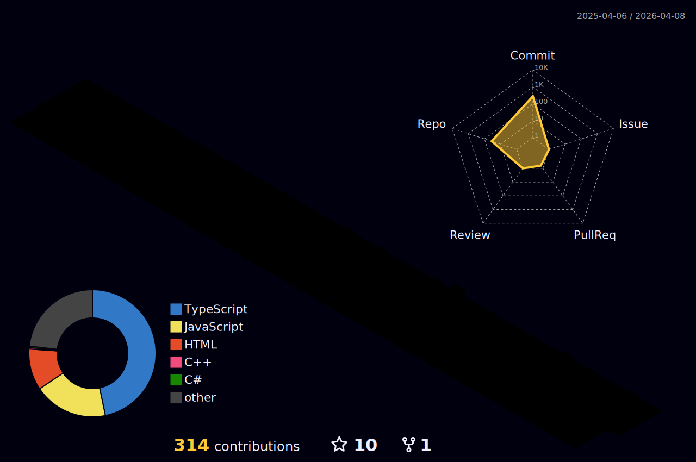

# **About Me**

**Third-year engineering student, surviving deadlines**  
**Loves vibecoding until my code works**  
**Creative, social, and easy to reach out to**  
**Mostly solving practical problems my college keeps throwing at me**

---

# **Tech Stack**
 
 
 
 
 
 
 
 
 
 
 
 
 
 
 
 

---

# **Socials**

 
 

---

<picture>
  <source media="(prefers-color-scheme: dark)" srcset="https://raw.githubusercontent.com/workwithaaditya/workwithaaditya/output/github-contribution-grid-snake-dark.svg">
  
</picture>

---

--- 
# **GitHub Stats**
 
 

--- 
